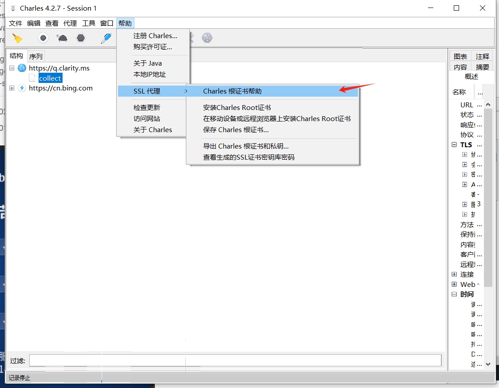
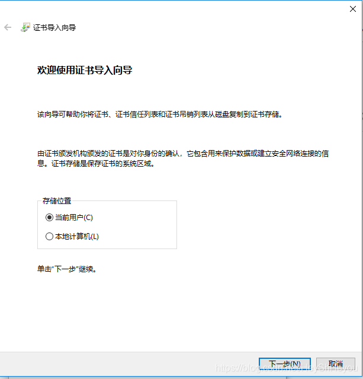
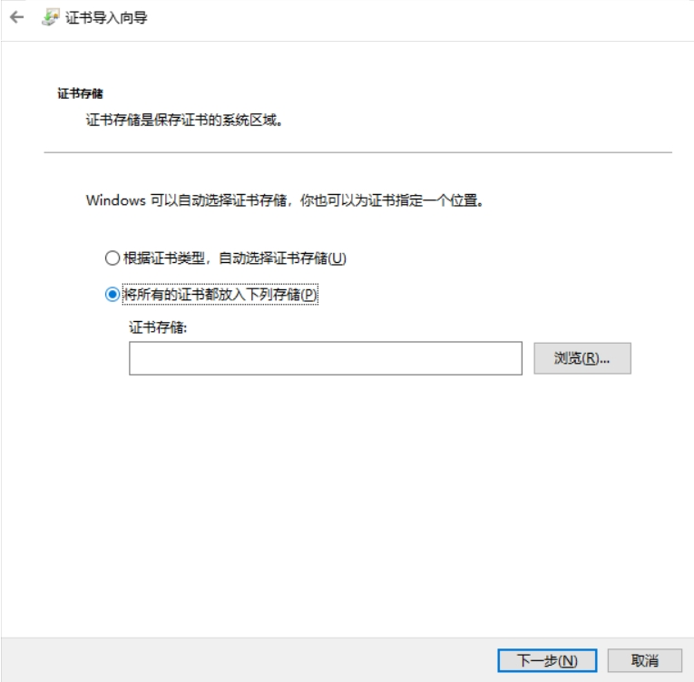
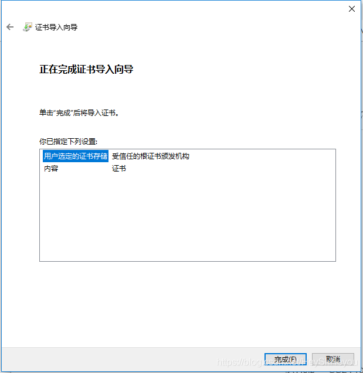
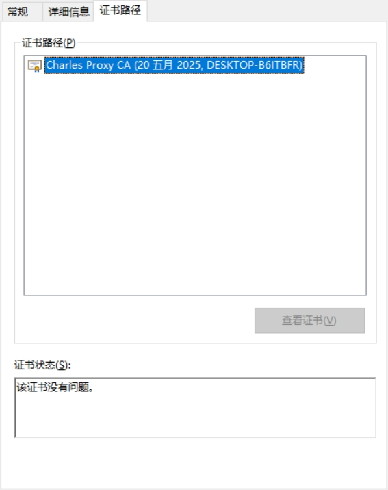
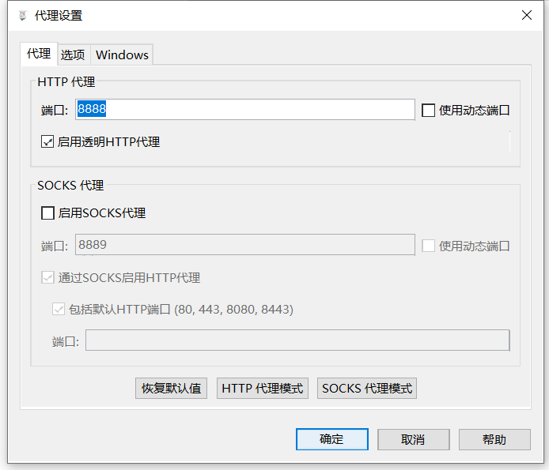
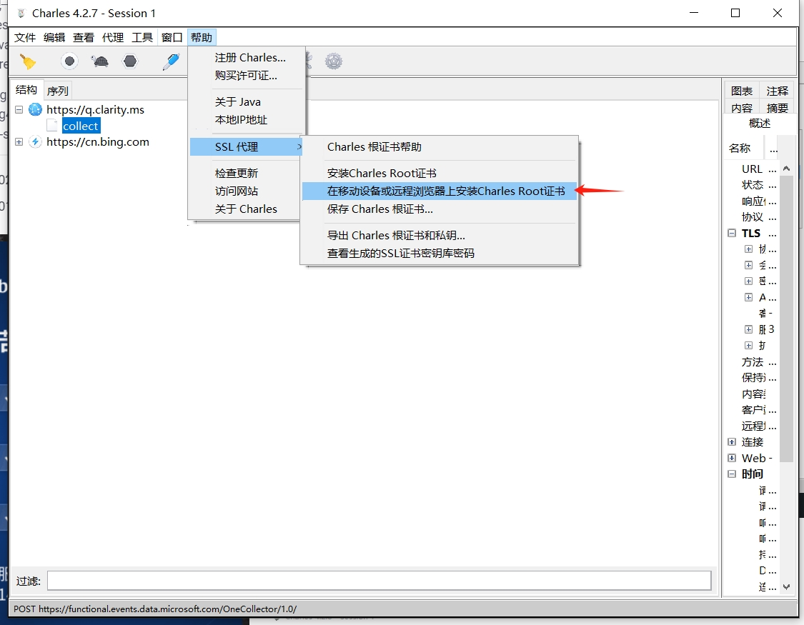
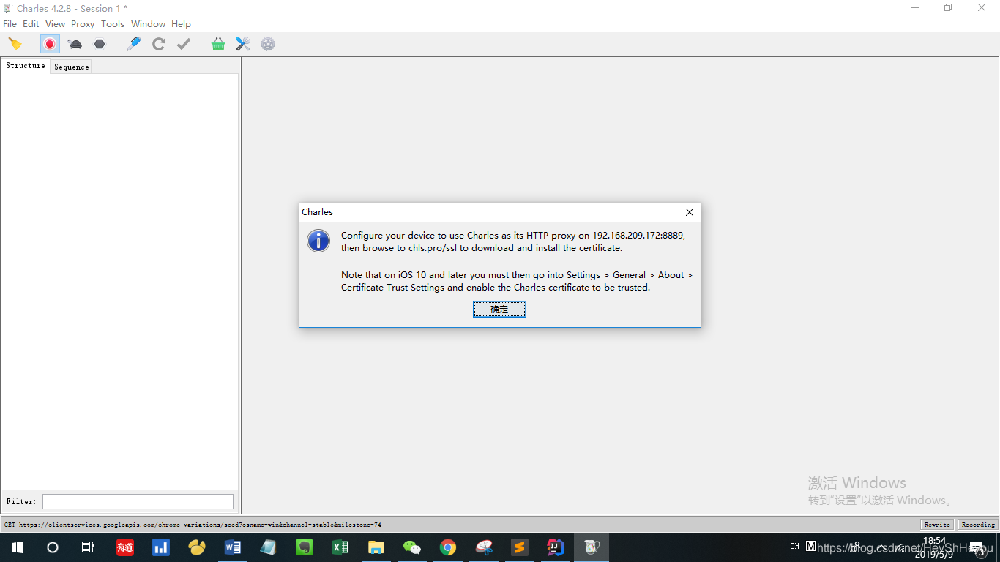
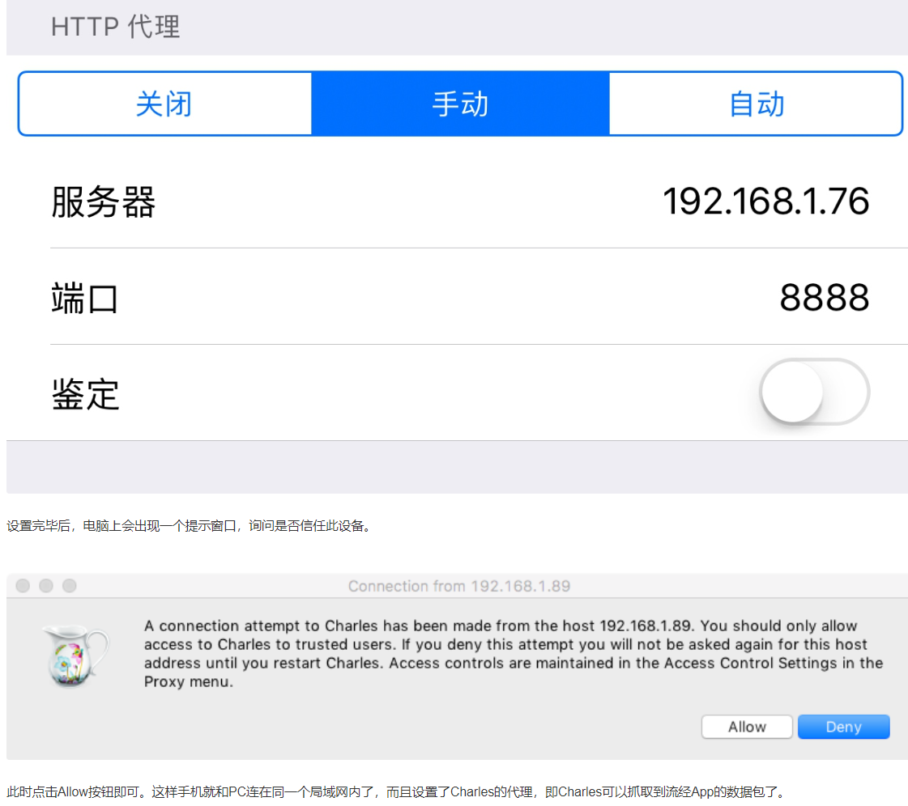
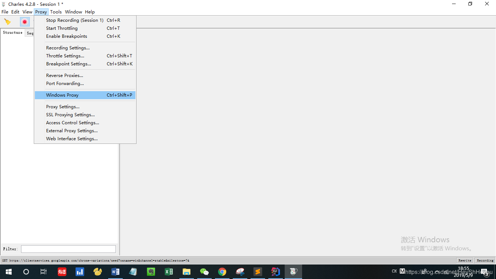

# 利用charles抓微信小程序包
微信小程序中的数据分析，与一般的网页爬虫类似，主要目标是获取主要的URL地址进行数据爬取，而问题的关键在于如何获取移动端request请求后https加密的参数。

本文参考了[Python爬取微信小程序（Charles）](https://blog.csdn.net/HeyShHeyou/article/details/90045204) 几个链接

```
├── img/                # 存放图片资源
├── Charles/      # 存放 Charles 抓包工具安装包
└── README.md           # 抓包微信小程序的示例说明文档
```

## 准备工作
Charles 4.2.7 中文版下载：下载Charles/ 文件夹直接打开Charles.exe即可
## PC端
1. 证书配置
**Charles安装证书**
Help -> SSL Proxying -> Install Charles Root Certificate

点击安装证书,点击下一步，

在此选择第二个，将所有证书都放入下列存储，点击浏览，选择受信任的根证书颁发机构。

确定后下一步。

点击完成后提示导入成功。此时需要重新进入Help -> SSL Proxying -> Install Charles Root Certificate，查看证书结果，成功时如下提示：


2. 代理->代理设置->启用透明HTTP代理

这个时候就能抓到电脑上的包了

适用于电脑端小程序抓包。但是，如果直接还是按照网页那样搞还是不行。要设置同样的代理和pem来爬虫。
```python
proxies = {
    'http': 'http://localhost:8888',  # Charles默认代理端口
    'https': 'http://localhost:8888'
}
header = {##自己填
        'User-Agent': '',
        "referrer": "",
        "cookie":""
}
url = f"你请求的网址"

response = requests.get(url, headers=header,proxies=proxies,verify='charles.pem')
```

## **移动端安装证书（重要！但是我后来还是在PC端抓的小程序，所以也可以不设置，但也许对其它apk是有用的）**

选择在移动端安装证书选项，Charles提示如下：(这里我用的别人的图，总之要记住里面提到的IP地址)




## 手机端的操作：
### 1. 下载证书
   
注意！他会告诉你在手机端访问chls.pro/ssl下载证书，但这个不好使了。
可以换成 https://www.charlesproxy.com/assets/legacy-ssl/charles.crtchls.pro/ssl

或者 http://ssl.charles （亲测好用）

### 安装证书和代理
1. 代理：需要在你的WIFI设置上把上面的IP地址和端口设置上去（链接同一个WIFI）


2. 怎么安装证书，建议自己搜。一般来讲：
- 安卓手机：手机设置-wlan-高级设置-从存储设备安装-找到证书后点击安装
- 苹果手机：手机设置→通用→关于本机→证书信任设置

### 如果不想要电脑的数据，可以取消windows代理
减少无关的数据量。


### 做完以上就可以抓到手机的包了。

这个我发现有的地方会上不去（我能成功抓到微信公号的阅读链接的包，但是有的小程序的数据它返回不回来。），可能是因为是系统证书不是的原因

这几个链接可能有用(因为我的手机是鸿蒙的，又要下东西我不想下载所以没弄了)

**安卓**
https://www.cnblogs.com/zj420255586/p/14652194.html
```
//cer格式
openssl x509 -inform DER -text -in xxx.cer > 0dd2455e.0
//pem格式
openssl x509 -inform PEM -text -in xxx.pem > 0dd2455e.0
```
```
执行:
1. adb push 0dd2455e.0 /sdcard
2. adb shell
3. su
4. mount -o remount,rw /system
#mount -o rw,remount /system
1. cp /sdcard/0dd2455e.0 /system/etc/security/cacerts/
2. chmod 644 /system/etc/security/cacerts/0dd2455e.0
```
**鸿蒙**
https://developer.huawei.com/consumer/cn/forum/topic/0201142783681394314

方法一：启动证书安装器进行指定pem证书安装。
1. 将Charles导出的pem文件hdc file send到手机存储器内。
2. hdc shell aa start -a MainAbility -b com.ohos.certmanager 启动证书安装。
3. 选择从存储设备安装，选择指定pem证书。

方法二：替换CA证书，证书路径为沙箱映射路径，系统预设CA证书位置：/etc/ssl/certs/cacert.pem，将Charles导出的pem文件hdc file send到此路径下（目前仅支持后缀名为.pem的文本格式证书）。

1. 示例命令：
```
//重新挂载根目录为可写
hdc shell mount -o remount,rw /
//导入根证书
hdc file send ./cacert.pem /etc/ssl/certs/
```
2. 再次，安装Charles证书到PC系统可信目录。
    
    点击 Help -> SSL Proxying -> Install Charles Root Certificate -> 安装证书 -> 选择证书存储路径为：受信任的根证书颁发机构。

3. 最后，设置代理。

    点击 Proxy -> SSL Proxy Settings -> 在Include添加 *:* 和 *:443

    点击 Proxy -> Proxy Settings -> 勾选Enable transparent HTTP proxying

